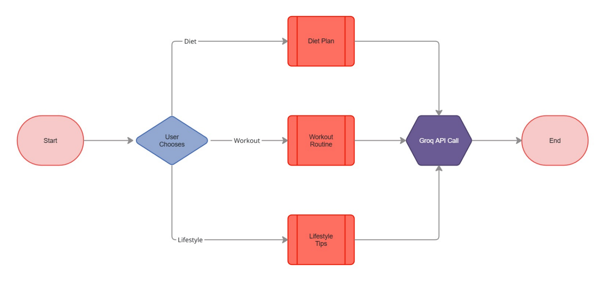

# 🏋️‍♂️ AI Health & Fitness Planner

An AI-powered Health & Fitness Planning application built using **Streamlit** and **Groq's Llama 3.1 (8B Instant)** model.

The app calculates personalized calorie recommendations using deterministic health formulas and generates optimized meal and workout plans using a cloud-based Transformer model.

---

## 🚀 Features

### 🔥 1. Smart Calorie Calculation (Deterministic Logic)

- Uses the **Mifflin–St Jeor Equation**
- Calculates:
  - Basal Metabolic Rate (BMR)
  - Total Daily Energy Expenditure (TDEE)
  - Goal-based recommended calorie intake
- Provides concise health guidance:
  - Daily walking
  - Recovery & sleep
  - Hydration
  - Consistency principles

---

### 🥗 2. Customised Meal Plan Generation

- Structured daily meal plan
- Breakfast, Lunch, Dinner, Snacks
- Approximate calorie distribution
- Tailored to user goal and calorie target

---

### 🏋️ 3. Optimised Workout Routine

- Weekly split
- Exercises
- Sets & reps
- Recovery guidelines
- Clear and concise structure

---

## 🧠 Architecture



---

## ⚙️ Tech Stack

- **Frontend:** Streamlit  
- **LLM Inference:** Groq API  
- **Model:** Llama 3.1 8B Instant (Decoder-only Transformer)  
- **Language:** Python  

---

## 📦 Installation

### 1️⃣ Clone the Repository

```bash
git clone https://github.com/sornamaheshwar/AI_Health_and_Fitness_Planner.git
cd AI_Health_and_Fitness_Planner
```

### 2️⃣ Create Virtual Environment

```bash
python -m venv .venv
```

**Activate the environment:**

**Windows:**
```bash
.venv\Scripts\activate
```

**Mac/Linux:**
```bash
source .venv/bin/activate
```

### 3️⃣ Install Requirements

```bash
pip install -r requirements.txt
```

---

## 🔑 Groq API Setup

Create an API key at:
```
https://console.groq.com
```

Run the application:
```bash
streamlit run health_agent.py
```

Enter your API key in the sidebar.

---

## ☁️ Deployment

You can deploy for free on:

- **Streamlit Community Cloud**
- **Render**
- **HuggingFace Spaces**

⚠️ **Never hardcode your API key.**  
Use environment variables or platform secrets instead.

---

## 📊 Groq Free Tier (At Time of Development)

- 30 requests per minute
- 14,400 requests per day
- 500,000 tokens per day

Suitable for demo and portfolio usage.

---

## 🔒 Security Notes

- Keep API keys private
- Do not commit secrets to GitHub
- Use environment variables in production

---

## 🚀 Future Improvements

- Macro breakdown (Protein/Carbs/Fats)
- BMI calculator
- Progress tracking
- PDF export
- Streaming responses
- Token usage monitoring
- Rate limiting

---

## 👨‍💻 Author

**M Sakthi Sorna Maheswar**  
AI / ML  Project

---


